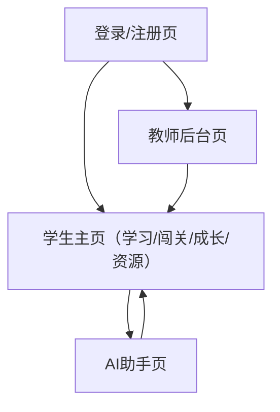

## 1. Product Overview
面向初高中生的普法互动学习平台，以“像多邻国一样”的轻量激励与闯关学习，帮助你在真实情境中理解并运用基本法律常识。
支持学生学习与成长记录、资源查阅、AI问答辅导，以及教师在后台查看班级学习进度与布置学习任务。

## 2. Core Features

### 2.1 User Roles
| 角色 | 注册/登录方式 | 核心权限 |
|------|--------------|----------|
| 学生 | 手机号/邮箱 + 密码；支持第三方登录（可选MVP后） | 进行学习闯关、查看成长与资源、使用AI助手、查看教师布置任务 |
| 教师 | 学校邮箱/手机号注册；可由管理员导入开通（MVP推荐） | 创建/管理班级、查看学生进度、布置任务、发布资源 |

### 2.2 Feature Module
本产品MVP由以下核心页面构成：
1. **登录/注册页**：学生/教师登录入口、基础账号创建。
2. **学生主页（学习+闯关+成长+资源）**：学习路径、关卡入口、成长激励、资源列表与检索、任务入口。
3. **AI助手页**：普法问答、情境引导、个性化推荐资源/关卡。
4. **教师后台页**：班级与学生管理、学习进度看板、任务布置、资源发布。

### 2.3 Page Details
| Page Name | Module Name | Feature description |
|-----------|-------------|------------------|
| 登录/注册页 | 账号认证 | 完成学生/教师登录与注册；校验密码；找回密码（MVP可仅提供重置链接/验证码）。 |
| 登录/注册页 | 角色选择与跳转 | 选择“我是学生/教师”；登录成功后跳转到对应端主页。 |
| 学生主页 | 全局导航 | 展示顶部导航（学习/闯关、成长、资源、任务、AI助手入口）；显示当前昵称、等级/经验值概览。 |
| 学生主页 | 学习路径与关卡列表 | 展示课程单元与关卡（锁定/可学/已完成）；进入关卡学习；记录完成度与得分。 |
| 学生主页 | 关卡内交互（闯关） | 进行题目作答（单选/判断/简答MVP可选）；提交后展示对错、简要解析、引用的法条要点；支持继续下一题/退出。 |
| 学生主页 | 成长系统 | 显示经验值、等级、徽章与学习连续天数（可选）；基于完成关卡/任务自动更新成长数据。 |
| 学生主页 | 资源中心 | 浏览资源（案例/法条摘要/视频/图文）；按主题/年级/关键词筛选；打开资源详情；记录浏览历史（可选）。 |
| 学生主页 | 教师任务入口 | 查看任务列表（待完成/已完成）；进入对应关卡或资源；提交完成状态。 |
| AI助手页 | 对话与安全提示 | 输入问题、查看多轮对话；对未成年友好提示（不提供法律意见，仅学习解释）；支持一键清空会话。 |
| AI助手页 | 推荐与跳转 | 根据问题推荐相关资源与关卡；点击可跳转到资源/关卡。 |
| 教师后台页 | 班级管理 | 创建班级、生成加入码/链接；查看成员列表；移除成员（可选）。 |
| 教师后台页 | 学习进度看板 | 按班级查看学生关卡完成率、平均正确率、活跃度；支持按单元/关卡筛选。 |
| 教师后台页 | 任务布置 | 选择班级+关卡/资源+截止时间；发布任务；查看完成情况。 |
| 教师后台页 | 资源发布（MVP轻量） | 上传/发布资源（标题、类型、标签、内容或链接）；对学生端可见。 |

## 3. Core Process
**学生流程**：你注册/登录 → 进入学生主页 → 选择单元与关卡闯关 → 获得解析与经验值/徽章 → 在“成长”查看记录 → 在“资源”查阅案例与法条摘要 → 遇到问题进入AI助手提问并按推荐继续学习/查资源 → 如有教师任务按任务完成并回传状态。

**教师流程**：你注册/登录 → 进入教师后台 → 创建班级并生成加入码 → 学生加入 → 你在看板查看整体进度 → 选择关卡/资源布置任务并设置截止时间 → 追踪完成情况并在课堂调整教学。

