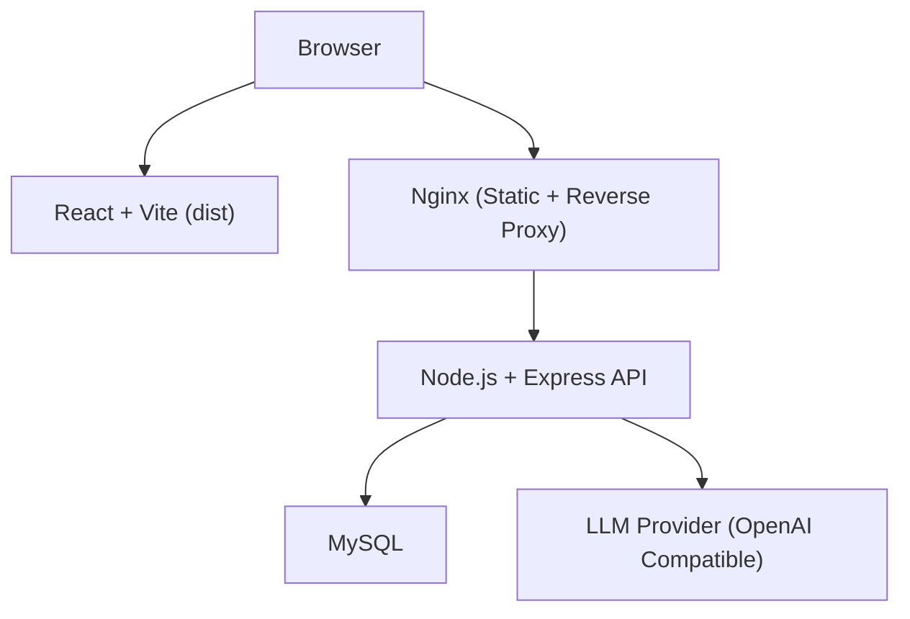

## 1) 架构设计

## 2) 技术栈
- 前端：React 18 + react-router-dom + TypeScript + TailwindCSS
- 后端：Node.js + Express + Prisma + MySQL
- 认证：JWT（前端存储 token，后端 `Authorization: Bearer <token>`）
- AI：后端 `/api/ai/chat` 代理（可配置 OpenAI Base URL / Model / Key）

## 3) 前端路由
| Route | Purpose |
|---|---|
| /login | 学生/教师登录与注册 |
| /app/learn | 学生端：学习闯关 |
| /app/growth | 学生端：成长 |
| /app/resources | 学生端：资源中心 |
| /app/tasks | 学生端：教师任务 |
| /assistant | AI助手 |
| /teacher/dashboard | 教师端：进度看板 |
| /teacher/classes | 教师端：班级管理 |
| /teacher/assignments | 教师端：任务布置 |
| /teacher/resources | 教师端：资源发布 |

## 4) 后端API（MVP）
| Method | Path | Desc |
|---|---|---|
| POST | /api/auth/register | 注册（学生/教师） |
| POST | /api/auth/login | 登录并返回JWT |
| GET | /api/auth/me | 获取当前用户信息 |
| GET | /api/student/units | 学习单元与关卡列表（含进度） |
| GET | /api/student/levels/:levelId/questions | 关卡题目 |
| POST | /api/student/levels/:levelId/submit | 提交答案并结算XP |
| GET | /api/student/summary | 成长统计（次数、平均分、完成数） |
| POST | /api/student/join-class | 学生加入班级（加入码） |
| GET | /api/student/tasks | 学生任务列表 |
| POST | /api/student/tasks/:assignmentId/submit | 提交任务完成 |
| GET | /api/resources | 资源列表（搜索/筛选） |
| GET | /api/resources/:id | 资源详情 |
| GET | /api/teacher/classes | 教师班级列表 |
| POST | /api/teacher/classes | 创建班级 |
| GET | /api/teacher/classes/:classId/members | 班级学生与进度汇总 |
| GET | /api/teacher/dashboard | KPI看板 |
| GET | /api/teacher/assignments | 任务列表（含完成数） |
| POST | /api/teacher/assignments | 发布任务 |
| POST | /api/teacher/resources | 发布资源 |
| POST | /api/ai/chat | AI对话（后端代理） |

## 5) 数据模型
数据结构由 Prisma Schema 定义：
- `prisma/schema.prisma`
迁移SQL可用于生产部署：
- `prisma/migrations/0001_init/migration.sql`
